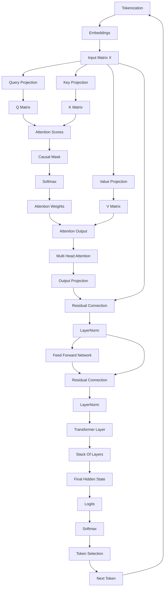

# Decoder-Only Transformer Knowledge Graph

## Learning Order

1. [[01-Decoder-Only-Transformer-Overview]]
2. [[02-Tokenization]]
3. [[03-Embeddings]]
4. [[04-Matrix-Multiplication]]
5. [[05-Linear-Projections]]
6. [[06-Queries-Keys-Values]]
7. [[07-Self-Attention]]
8. [[08-Causal-Masking]]
9. [[09-Multi-Head-Attention]]
10. [[10-Residual-Connections]]
11. [[11-LayerNorm]]
12. [[12-FeedForward-Network]]
13. [[13-Transformer-Layer]]
14. [[14-Final-Hidden-State]]
15. [[15-Logits]]
16. [[16-Softmax]]
17. [[17-Token-Sampling]]